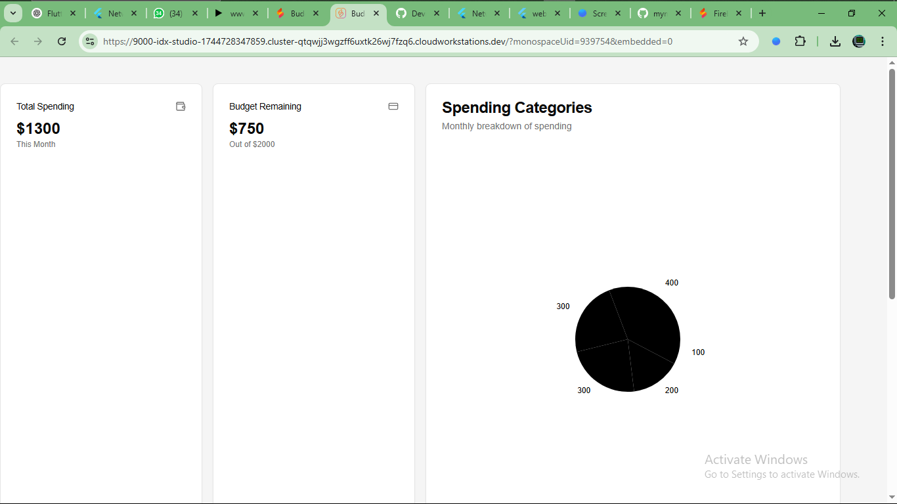
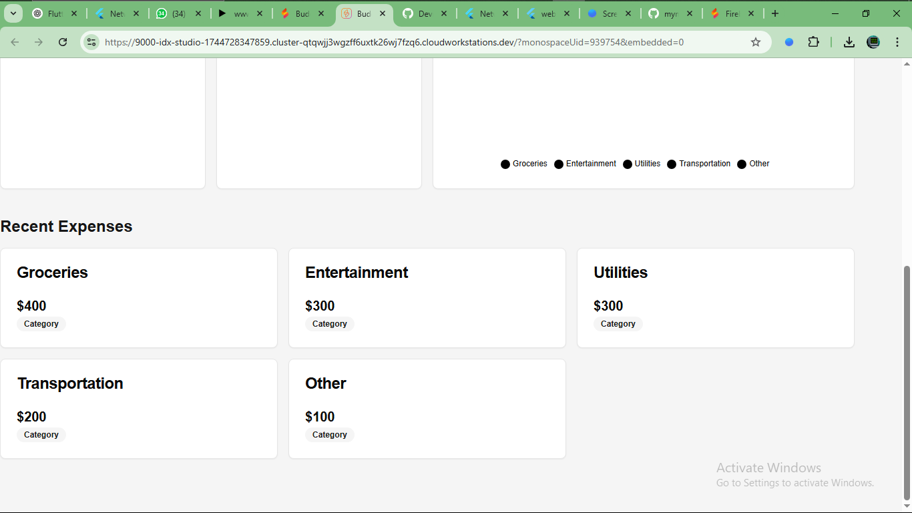

# Firebase Studio

This is a NextJS starter in Firebase Studio.

To get started, take a look at src/app/page.tsx.

## Documentation

The Expense Tracker application helps users manage their finances by providing a clear overview of their spending habits. Users can easily add, categorize, and track their expenses over time.

**How to Use:**
1.  **Adding Expenses:** To add a new expense, click the "Add Expense" button. Fill in the necessary details such as the amount, category (e.g., food, transportation, entertainment), and date.
2.  **Viewing Expenses:** The main view displays a list of all recorded expenses, sorted by date. Each entry includes the amount, category, and a brief description.
3.  **Filtering and Sorting:** You can filter expenses by category or date range to focus on specific spending periods or areas. Expenses can also be sorted by amount or date.
4.  **Detailed View:** Clicking on an expense entry will open a detailed view, providing additional information about the transaction and potentially allowing for editing or deletion.

**Main Features:**
*   **Expense Tracking:** Log and categorize individual expenses.
*   **Summary and Reports:** Generate summaries and reports to analyze spending patterns over time.
*   **User-Friendly Interface:** Intuitive design for easy navigation and expense management.
*   **Data Persistence:** Securely store expense data for future access and analysis.

## Screenshots

Here are some screenshots of the Expense Tracker UI:

### Main View

### Detailed Expense View

